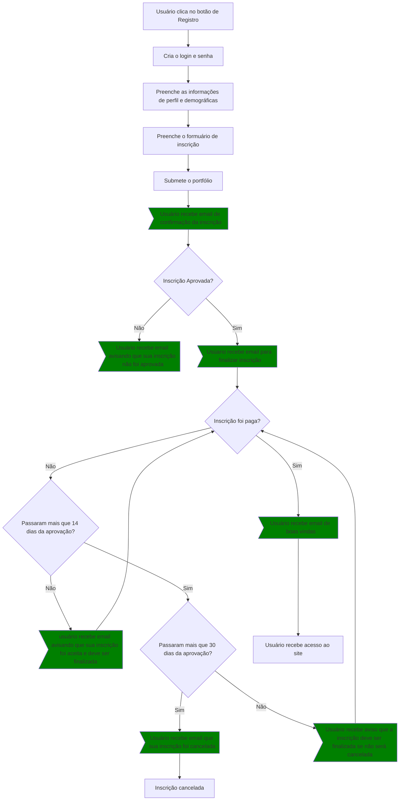

## Fluxo inscrição

```mermaid
graph TD
    A[Usuário clica no botão de Registro] --> B[Cria o login e senha]
    B --> C[Preenche as informações de perfil e demográficas]
    C --> D[Preenche o formuário de inscrição]
    D --> E[Submete o portfólio]
    E --> F>Usuário recebe email de confirmação da inscrição]
    F:::email --> G{Inscrição Aprovada?}
    G --Não --> H>Usuário recebe email avisando que sua inscrição não foi aprovada]
    H:::email
    G --Sim --> I>Usúario recebe email para finalizar inscrição]
    I:::email --> J{Inscrição foi paga?}
    J -- Não --> K{Passaram mais que 14 dias da aprovação?}
    K -- Não --> L>usuário recebe email avisando que sua inscrição foi aceita e deve ser finalizada]
    L:::email --> J
    K -- Sim --> N{Passaram mais que 30 dias da aprovação?}
    N -- Sim --> O>Usuário recebe email que sua inscrição foi cancelada]
    O:::email --> S[Inscrição cancelada]
    N -- Não --> P>Usuário recebe aviso que a inscrição deve ser finalizada se não será cancelada]
    P:::email --> J
    J --Sim --> Q>Usuário recebe email de boas vindas]
    Q:::email --> R[Usuário recebe acesso ao site]
    classDef email fill:green
```