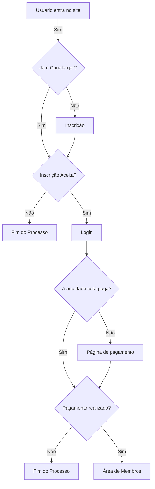

Com a chegada do período de renovação das anuidades, é importante utilizar as ferramentas que facilitem a administração dos membros do coletivo. Implementar a integração do site com uma plataforma de pagamentos é uma forma de garantir mais segurança, controle e escalabilidade para o Coletivo.

## Objetivos
1. **Coletar o pagamento de novos membros pelo site**
2. **Renovar a filiação de atuais membros do Conafarq**
3. **Ferramenta de gestão dos membros?**

## Fluxo proposto

## Orçamento

||Demanda|Tempo Estimado (hrs)|Custo|
|--- |--- |--- |--- |
|1|Integração do site com API do Stripe|16|R$ 960,00|
|2|Criação da Página de Pagamento (Design e Desenvolvimento)|12|R$ 720,00|
|3|Alteração do fluxo do inscrição de novos membros para incluir o pagamento da anuidade|6|R$ 360,00|
|4|Criação do fluxo de renovação da anuidade para já membros|6|R$ 360,00|
|5|Alteração no modelo de banco de dados dos usuários para guardar as informações relativas a filiação no coletivo|8|R$ 480,00|
|6|Criação de ambiente de homologação para teste da nova feature de pagamento|24|R$ 1.440,00|

### Requerimentos

As novas features serão testadas por ambas as partes (Desenvolvedor e Membros do Conafarq) em um ambiente de testes disponibilizado pelo desenvolvedor, o funcionamento em produção dependerá do pleno funcionamento do serviço do Stripe.

### Prazo de início

Imediato

### Prazo de conclusão

2 semanas a contar da data de pagamento